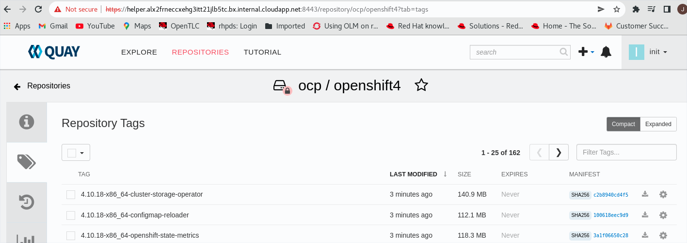

# quay-mirrot-registry

**Reference**

https://docs.openshift.com/container-platform/4.6/installing/installing-mirroring-installation-images.html#installing-mirroring-installation-images

**Git**
```
git init
git add README.md
git commit -m "first commit"
git branch -M main
git remote add origin https://github.com/alpha-wolf-jin/quay-mirrot-registry.git
git config --global credential.helper 'cache --timeout 7200'
git push -u origin main

git add . ; git commit -a -m "update README" ; git push -u origin main
```

## Prepare the FS

```
[root@quay ~]# lsblk
NAME              MAJ:MIN RM  SIZE RO TYPE MOUNTPOINT
sda                 8:0    0  512G  0 disk 
sdb                 8:16   0   64G  0 disk 
├─sdb1              8:17   0  500M  0 part /boot
├─sdb2              8:18   0   63G  0 part 
│ ├─rootvg-tmplv  253:0    0    2G  0 lvm  /tmp
│ ├─rootvg-usrlv  253:1    0   10G  0 lvm  /usr
│ ├─rootvg-homelv 253:2    0    1G  0 lvm  /home
│ ├─rootvg-varlv  253:3    0    8G  0 lvm  /var
│ └─rootvg-rootlv 253:4    0    2G  0 lvm  /
├─sdb14             8:30   0    4M  0 part 
└─sdb15             8:31   0  495M  0 part /boot/efi
sdc                 8:32   0   16G  0 disk 
└─sdc1              8:33   0   16G  0 part /mnt

[root@quay ~]# pvcreate /dev/sda

[root@quay ~]# vgcreate quay /dev/sda

[root@quay ~]# lvcreate -l 100%FREE -n lv00 quay

[root@quay ~]# mkfs.xfs /dev/quay/lv00 

[root@quay ~]# mkdir /opt/registry

[root@quay ~]# mount /dev/quay/lv00 /opt/registry
[root@quay ~]# mount | grep reg
/dev/mapper/quay-lv00 on /opt/registry type xfs (rw,relatime,seclabel,attr2,inode64,logbufs=8,logbsize=32k,noquota)

[root@quay ~]# vi /etc/fstab 
/dev/mapper/quay-lv00 /opt/registry  xfs rw,relatime,seclabel,attr2,inode64,logbufs=8,logbsize=32k,noquota 0 0

[root@quay ~]# umount /opt/registry 

[root@quay ~]# mount -a

# hostnamectl set-hostname quay.example.opentlc.com

# mkdir /opt/registry/quay

```

## Prepare the binary

Red Hat Enterprise Linux (RHEL) 8 with Podman 3.3 and OpenSSL installed.

```

# mkdir /opt/registry/install

# cd /opt/registry/install

# yum install podman -y

$ podman --version
podman version 4.0.2

$ sudo yum list openssl
Last metadata expiration check: 1:14:08 ago on Tue 21 Jun 2022 02:01:29 AM UTC.
Installed Packages
openssl.x86_64                                             1:1.1.1k-6.el8_5                                             @anaconda

$ cat /etc/redhat-release 
Red Hat Enterprise Linux release 8.6 (Ootpa)

$ wget https://developers.redhat.com/content-gateway/rest/mirror/pub/openshift-v4/clients/mirror-registry/latest/mirror-registry.tar.gz

$ tar xvf mirror-registry.tar.gz

$ sudo ./mirror-registry install --quayHostname $(hostname -f) --quayRoot  /opt/registry/quay

INFO[2022-06-21 03:18:21] Quay installed successfully, permanent data is stored in /opt/registry/quay
INFO[2022-06-21 03:18:21] Quay is available at https://quay.example.opentlc.com:8443 with credentials (init, 23cObG84sL1DXrJK6yl9RUdk7ZPieT50) 

$ ll /opt/registry/quay/quay-rootCA/
total 12
-rw-------. 1 root root 1675 Jun 21 03:16 rootCA.key
-rw-r--r--. 1 root root 1521 Jun 21 03:16 rootCA.pem
-rw-r--r--. 1 root root   41 Jun 21 03:16 rootCA.srl

$ sudo cp -p  /opt/registry/quay/quay-rootCA/rootCA.pem /etc/pki/ca-trust/source/anchors/.

$ sudo update-ca-trust 

$ sudo trust list

$ podman login --authfile ~/pull-secet.txt -u init -p 23cObG84sL1DXrJK6yl9RUdk7ZPieT50 quay.example.opentlc.com:8443
Login Succeeded!

# --tls-verify=false   if did not add rootCA to trust list

# Add host to local hosts file
# cat /etc/hosts
127.0.0.1   localhost localhost.localdomain localhost4 localhost4.localdomain4 oauth-openshift.apps.ocp4.example.com ansible-tower-web-svc-tower.apps.ocp4.example.com console-openshift-console.apps.ocp4.example.com example-ansible-automation-platform.apps.ocp4.example.com examplehub-ansible-automation-platform.apps.ocp4.example.com
::1         localhost localhost.localdomain localhost6 localhost6.localdomain6

# sudo ssh -L 443:192.168.9.5:443 root@192.168.122.29  <== tunel from local 127.0.0.1 443  => 192.168.122.29 => 192.168.9.5:443

20.55.58.122  quay.example.opentlc.com

```

# Add the inbound rule 

Azure Portal

https://portal.azure.com


Access Quay via browser


**The latest OCP version**

https://mirror.openshift.com/pub/openshift-v4/x86_64/clients/ocp/


```
$ wget https://mirror.openshift.com/pub/openshift-v4/x86_64/clients/ocp/4.10.11/openshift-client-linux-4.10.11.tar.gz

$ sudo tar -xvf openshift-client-linux-4.10.11.tar.gz  -C /usr/local/sbin

$ oc version
Client Version: 4.10.11

$ wget https://mirror.openshift.com/pub/openshift-v4/x86_64/clients/ocp/4.10.11/openshift-install-linux-4.10.11.tar.gz

$ sudo tar -xvf openshift-install-linux-4.10.11.tar.gz  -C /usr/local/sbin

$ openshift-install version
openshift-install 4.10.11
built from commit 25b4d09c94dc4bdc0c79d8668369aeb4026b52a4
release image quay.io/openshift-release-dev/ocp-release@sha256:195de2a5ef3af1083620a62a45ea61ac1233ffa27bbce7b30609a69775aeca19
release architecture amd64

$ wget https://mirror.openshift.com/pub/openshift-v4/x86_64/clients/ocp/4.10.11/opm-linux-4.10.11.tar.gz

$ sudo tar -xvf opm-linux-4.10.11.tar.gz  -C /usr/local/sbin

$ opm version
Version: version.Version{OpmVersion:"1a99acbce", GitCommit:"1a99acbce6d3fe39fb755c762c362807c98bfc5d", BuildDate:"2022-06-01T00:25:02Z", GoOs:"linux", GoArch:"amd64"}

```

# Mirroring OCP Cluster  Installation Images


## Check mirror registry and OCP registry credentials

```
$ cat ~/pull-secet.txt | jq .
{
  "auths": {
    "cloud.openshift.com": {
      "auth": "b3BlbnNoaWZ0LXJlbGVhc2UtZGV2K2ppbnpoYTFyZWRoYXRjb20xb3M5eXVkNGF0a2toN3ZzZGJuOXE1dGkxZ3c6VEk1TkUyVVZTVFlNVVBPTktDQktUTVhOT0VZM1ZXS1ZLSEdaSFhXNDEyWDVNSUVZMjVTRjc1S1BOVTIwSVYwSw=="
    },
    "quay.example.opentlc.com:8443": {
      "auth": "aW5pdDoyM2NPYkc4NHNMMURYckpLNnlsOVJVZGs3WlBpZVQ1MA=="
    },
    "quay.io": {
      "auth": "b3BlbnNoaWZ0LXJlbGVhSVYwSw=="
    },
    "registry.connect.redhat.com": {
      "auth": "NTEzMTc5Njd8dWhjLTFPLMEF6ZktmZlFxLXZCMnF3V3R6bUFlQXFxNkpnaw=="
    },
    "registry.redhat.io": {
      "auth": "NTEzMTc5Njd8dWhjLTFPMTJLMEF6ZktmZlFxLXZCMnF3V3R6bUFlQXFxNkpnaw=="
    }
  }
}
```

## Prepare the Parms

```
$ OCP_RELEASE=4.10.11
$ LOCAL_REGISTRY='quay.example.opentlc.com:8443'
$ LOCAL_REPOSITORY='ocp/openshift4'
$ PRODUCT_REPO='openshift-release-dev'
$ LOCAL_SECRET_JSON='/home/azureuser/pull-secet.txt'
$ RELEASE_NAME="ocp-release"
$ ARCHITECTURE=x86_64
$ REMOVABLE_MEDIA_PATH=/opt//registry/media
$ mkdir -p /opt//registry/media
```

## Dry-RUN  to get ImageContentSourcePolicy (162 images)

Record the entire imageContentSources section from the output of the previous command. The information about your mirrors is unique to your mirrored repository, and you must add the imageContentSources section to the install-config.yaml file during installation.

```
$ oc adm release mirror -a ${LOCAL_SECRET_JSON}  \
      --from=quay.io/${PRODUCT_REPO}/${RELEASE_NAME}:${OCP_RELEASE}-${ARCHITECTURE} \
      --to=${LOCAL_REGISTRY}/${LOCAL_REPOSITORY} \
      --to-release-image=${LOCAL_REGISTRY}/${LOCAL_REPOSITORY}:${OCP_RELEASE}-${ARCHITECTURE} --dry-run
info: Mirroring 162 images to quay.example.opentlc.com:8443/ocp/openshift4 ...
. . .
info: Dry run complete

Success
Update image:  quay.example.opentlc.com:8443/ocp/openshift4:4.10.11-x86_64
Mirror prefix: quay.example.opentlc.com:8443/ocp/openshift4
Mirror prefix: quay.example.opentlc.com:8443/ocp/openshift4:4.10.11-x86_64

To use the new mirrored repository to install, add the following section to the install-config.yaml:

imageContentSources:
- mirrors:
  - quay.example.opentlc.com:8443/ocp/openshift4
  source: quay.io/openshift-release-dev/ocp-release
- mirrors:
  - quay.example.opentlc.com:8443/ocp/openshift4
  source: quay.io/openshift-release-dev/ocp-v4.0-art-dev


To use the new mirrored repository for upgrades, use the following to create an ImageContentSourcePolicy:

apiVersion: operator.openshift.io/v1alpha1
kind: ImageContentSourcePolicy
metadata:
  name: example
spec:
  repositoryDigestMirrors:
  - mirrors:
    - quay.example.opentlc.com:8443/ocp/openshift4
    source: quay.io/openshift-release-dev/ocp-release
  - mirrors:
    - quay.example.opentlc.com:8443/ocp/openshift4
    source: quay.io/openshift-release-dev/ocp-v4.0-art-dev
```

## Mirror the cluster images to local disk

```
$ oc adm release mirror -a ${LOCAL_SECRET_JSON} --to-dir=${REMOVABLE_MEDIA_PATH}/mirror quay.io/${PRODUCT_REPO}/${RELEASE_NAME}:${OCP_RELEASE}-${ARCHITECTURE}
Success
Update image:  openshift/release:4.10.11-x86_64

To upload local images to a registry, run:

    oc image mirror --from-dir=/opt//registry/media/mirror 'file://openshift/release:4.10.11-x86_64*' REGISTRY/REPOSITORY

Configmap signature file /opt//registry/media/mirror/config/signature-sha256-195de2a5ef3af108.yaml created

$ ll /opt//registry/media/
total 0
drwxr-xr-x. 4 azureuser azureuser 30 Jun 21 04:28 mirror

$ ll /opt//registry/media/mirror/
total 0
drwxr-x---. 2 azureuser azureuser 52 Jun 21 04:28 config
drwxr-xr-x. 3 azureuser azureuser 23 Jun 21 04:26 v2

$ cat /opt//registry/media/mirror/config/signature-sha256-195de2a5ef3af108.yaml | jq .
{
  "kind": "ConfigMap",
  "apiVersion": "v1",
  "metadata": {
    "name": "sha256-195de2a5ef3af1083620a62a45ea61ac1233ffa27bbce7b30609a69775aeca19",
    "namespace": "openshift-config-managed",
    "creationTimestamp": null,
    "labels": {
      "release.openshift.io/verification-signatures": ""
    }
  },
  "binaryData": {
    "sha256-195de2a5ef3af1083620a62a45ea61ac1233ffa27bbce7b30609a69775aeca19-1": "owGbwMvMwMEoOU9/4l9n2UDGtYwpSWLxRQW5xZnpukWphbrZkUXB+T56SZl5SQutkquVkosySzKTE3OUrBSqlTJzE9NTwayU/OTs1CLd3MS8zLTU4hLdlMx0IAWUUirOSDQyNbMytDRNSTVKNE1NM05MMzSwMDYzMkg0M0o0MU1NNDNMTDY0MjZOS0s0Mk9KSk41TzI2MDOwTDSzNDc3TUxNTjS0VKrVUVAqqSwAWaeUWJKfm5mskJyfV5KYmZdapAB0bV5iSWlRqhJQVWZKal5JZkklssOKUtNSi1LzksHaC0sTK/Uy8/XzC1LzijMy00qA0jmpicWpuimpZfr5yQUwvpWJnqGBnqGFboWFWbyZiVItyBH5BSWZ+XnQEEguSgU6pghkalBqioJHYomCP9DUYJCpCsFAV2XmpSs4lpZk5APDrVLBQA9oHNCYTiZRZlYGUIjCQ55j8jv+/7Uu/XbHJ7Hs//N4Zf0KsbSZDx4Fifp9V53jsz1j4SPLhRadaod93tzeMP8Kb7DTZCa11fLnDxqGqJTu8st6VnEwYBdr+UrbmpA9Z5O21iT1t3YL8+bwPpvff/LYpTcPSu5Ulm/3draL1rtxz/zx2qQtr1LqvrUYnZqbXb3a40XEv5Ouc84fS7u15kXXhkaPy8mRe3LDHG4e+dQ313zJhtq1PQH2W/crnHr6OIn3g/7FXV43789+2samUd+gmMOUnKWg46Unm7lYep5Dzo3yfV3l5WHx72bnxB8y+5+z7EZOZcMCI6frai8e8T77dC+99lzt0WR5v6qZSWunmv28Zv+9LMAka5GBfAPXOukNZlVGj0ubmQpCD3lfvV13RnzvRE+Gnln15TYhVf+2ClwtKHyWfv13/+Z3x5MCjjWveVRxeqMQ+86eI88cNxYYzjm1aMG1pMbLwTcOTngcnZM0fxFT+AcZfh9ehYVfoq1Osu+KutIo9ZRza2vLpb39brwX+8s+K26eL3t9ueuas1ELf20SjA6QNMloXbmH4dyy2V0u/wKentd0E15jXe3Y23bgotCSG0I++dv2zPxxUPVIlLKAauL7wyqbZr+6dYirxGqFeU3sjw/NDuYFKdwXdfcyN/80Xt8wf6vqykReya6vD2/bhqrUWbgptQt9v6x8UoRN6ea3zxI7C814PhtrBETfDxIMFLv1toTrMxODIwA="
  }
}
```

## Take the media to the restricted network environment and upload the images to the local container registry.

```
$ echo ${LOCAL_REGISTRY}/${LOCAL_REPOSITORY}
quay.example.opentlc.com:8443/ocp/openshift4

$ podman login --authfile ~/pull-secet.txt -u init -p 23cObG84sL1DXrJK6yl9RUdk7ZPieT50 quay.example.opentlc.com:8443
Login Succeeded!

$ ls -l /opt//registry/media/mirror/
total 0
drwxr-x---. 2 azureuser azureuser 52 Jun 21 04:28 config
drwxr-xr-x. 3 azureuser azureuser 23 Jun 21 04:26 v2

$ find /opt//registry/media/mirror/ -name "*4.10.11*"
/opt//registry/media/mirror/v2/openshift/release/manifests/4.10.11-x86_64-machine-config-operator
/opt//registry/media/mirror/v2/openshift/release/manifests/4.10.11-x86_64-openshift-apiserver
/opt//registry/media/mirror/v2/openshift/release/manifests/4.10.11-x86_64-oauth-server
/opt//registry/media/mirror/v2/openshift/release/manifests/4.10.11-x86_64-aws-ebs-csi-driver
. . .

$ oc image mirror -a ${LOCAL_SECRET_JSON} --from-dir=/opt//registry/media/mirror 'file://openshift/release:4.10.11-x86_64*' ${LOCAL_REGISTRY}/${LOCAL_REPOSITORY}
. . .
info: Mirroring completed in 4m35.18s (46.11MB/s)

$ df -Th /data
Filesystem              Type  Size  Used Avail Use% Mounted on
/dev/mapper/datavg-data xfs   512G   33G  480G   7% /data


```

**162 Images in Quay**



# Using Operator Lifecycle Manager on restricted networks

**Reference**

https://docs.openshift.com/container-platform/4.10/operators/admin/olm-restricted-networks.html

Check the lastest grpcurl

https://github.com/fullstorydev/grpcurl/releases

On one session:
```
$ wget https://github.com/fullstorydev/grpcurl/releases/download/v1.8.6/grpcurl_1.8.6_linux_x86_64.tar.gz
$ sudo tar -xvf grpcurl_1.8.6_linux_x86_64.tar.gz  -C /usr/local/sbin
$ grpcurl --version
$ podman login -u XXXX -p YYYYY registry.redhat.io
$ podman run -p50051:50051 -it registry.redhat.io/redhat/redhat-operator-index:v4.10
```

On the other session
```
$ grpcurl -plaintext localhost:50051 api.Registry/ListPackages > packages.out

$ opm index prune -f registry.redhat.io/redhat/redhat-operator-index:v4.10 -p local-storage-operator,elasticsearch-operator,cluster-logging,compliance-operator,amq-streams,3scale-operator,rhacs-operator,compliance-operator,elasticsearch-operator,local-storage-operator,nfd,odf-operator,quay-operator -t quay.example.opentlc.com:8443/olm-mirror/redhat-operator-index:v4.10

podman save -o catalogsource.tar quay.example.opentlc.com:8443/olm-mirror/redhat-operator-index:v4.10
```


## Bring catalogsource.tar  to disconnection env

Push to the mirror registry

```
$ podman load -i catalogsource.tar

$ podman login -u init -p 23cObG84sL1DXrJK6yl9RUdk7ZPieT50 quay.example.opentlc.com:8443
Login Succeeded!

$ podman push quay.example.opentlc.com:8443/olm-mirror/redhat-operator-index:v4.10
```

## Dry-RUN to get imageContentSourcePolicy.yaml & catalogSource.yaml 
```

$ REG_CREDS=${XDG_RUNTIME_DIR}/containers/auth.json
$ cat $REG_CREDS
{
	"auths": {
		"quay.example.opentlc.com:8443": {
			"auth": "aW5pdDoyM2NPYkc4NHNMMURYckpLNnlsOVJVZGs3WlBpZVQ1MA=="
		},
		"registry.redhat.io": {
			"auth": "TUhBU1BGOkdlbmVzaXNfMDAwMDE="
		}
	}
}
```
> The below manifests-only cmd can run in disconnect evn

> Note the pull-secet.txt has only the local registry credential

> redhat-operator-index:v4.10 has to be there

```
# cat ~/pull-secet.txt
{
	"auths": {
		"quay.example.opentlc.com:8443": {
			"auth": "aW5pdDoyM2NPYkc4NHNMMURYckpLNnlsOVJVZGs3WlBpZVQ1MA=="
		}
	}
}

# oc adm catalog mirror quay.example.opentlc.com:8443/olm-mirror/redhat-operator-index:v4.10 quay.example.opentlc.com:8443 -a ~/pull-secet.txt --index-filter-by-os='linux/amd64' --manifests-only

# ll manifests-redhat-operator-index-1655994184
total 136
-rwxr-xr-x. 1 root root    274 Jun 23 14:23 catalogSource.yaml
-rwxr-xr-x. 1 root root  16149 Jun 23 14:23 imageContentSourcePolicy.yaml
-rw-r--r--. 1 root root 116971 Jun 23 14:23 mapping.txt

# cat manifests-redhat-operator-index-1655994184/imageContentSourcePolicy.yaml 
---
apiVersion: operator.openshift.io/v1alpha1
kind: ImageContentSourcePolicy
metadata:
  labels:
    operators.openshift.org/catalog: "true"
  name: redhat-operator-index-0
spec:
  repositoryDigestMirrors:
  - mirrors:
    - quay.example.opentlc.com:8443/rhscl/mysql-57-rhel7
    source: registry.redhat.io/rhscl/mysql-57-rhel7
  - mirrors:
    - quay.example.opentlc.com:8443/openshift4/compliance-content-rhel8
    source: registry.redhat.io/openshift4/compliance-content-rhel8
  - mirrors:
    - quay.example.opentlc.com:8443/amq7/amq-streams-rhel7-operator
    source: registry.redhat.io/amq7/amq-streams-rhel7-operator
  - mirrors:
    - quay.example.opentlc.com:8443/openshift4/ose-logging-fluentd
    source: registry.redhat.io/openshift4/ose-logging-fluentd

. . .

# oc adm catalog mirror quay.example.opentlc.com:8443/olm-mirror/redhat-operator-index:v4.9 quay.example.opentlc.com:8443 -a ~/pull-secet.txt --index-filter-by-os='linux/amd64' --manifests-only
error: image "quay.example.opentlc.com:8443/olm-mirror/redhat-operator-index:v4.9" not found: manifest unknown: manifest unknown

# ll manifests-redhat-operator-index-1655994768
total 0

```

```
$ oc adm catalog mirror quay.example.opentlc.com:8443/olm-mirror/redhat-operator-index:v4.10 quay.example.opentlc.com:8443 -a ${REG_CREDS} --index-filter-by-os='linux/amd64' --manifests-only

!!!!!!!!!!!!!!!!!!!!!!!!!!!!!!!!!!!!!!!!!!!!!!!!!!!!!!!!!!!!!!!!!!!!!!!!!!!!!!!!
!! DEPRECATION NOTICE:
!!   Sqlite-based catalogs are deprecated. Support for them will be removed in a
!!   future release. Please migrate your catalog workflows to the new file-based
!!   catalog format.
!!!!!!!!!!!!!!!!!!!!!!!!!!!!!!!!!!!!!!!!!!!!!!!!!!!!!!!!!!!!!!!!!!!!!!!!!!!!!!!!

src image has index label for database path: /database/index.db
using index path mapping: /database/index.db:/tmp/2046344077
wrote database to /tmp/2046344077
using database at: /tmp/2046344077/index.db
no digest mapping available for quay.example.opentlc.com:8443/olm-mirror/redhat-operator-index:v4.10, skip writing to ImageContentSourcePolicy
wrote mirroring manifests to manifests-redhat-operator-index-1655796324
deleted dir /tmp/2046344077

$ cat manifests-redhat-operator-index-1655796324/catalogSource.yaml 
apiVersion: operators.coreos.com/v1alpha1
kind: CatalogSource
metadata:
  name: redhat-operator-index
  namespace: openshift-marketplace
spec:
  image: quay.example.opentlc.com:8443/olm-mirror/redhat-operator-index:v4.10
  sourceType: grpc

$ cat manifests-redhat-operator-index-1655796324/imageContentSourcePolicy.yaml
---
apiVersion: operator.openshift.io/v1alpha1
kind: ImageContentSourcePolicy
metadata:
  labels:
    operators.openshift.org/catalog: "true"
  name: redhat-operator-index-0
spec:
  repositoryDigestMirrors:
  - mirrors:
    - quay.example.opentlc.com:8443/rh-acs/scanner-db
    source: registry.redhat.io/rh-acs/scanner-db
  - mirrors:
    - quay.example.opentlc.com:8443/openshift-logging/logging-curator5-rhel8
    source: registry.redhat.io/openshift-logging/logging-curator5-rhel8

```


## Mirror Opertors' image to local disk

```
$ pwd
/data/azureuser

$ oc adm catalog mirror quay.example.opentlc.com:8443/olm-mirror/redhat-operator-index:v4.10 file:///local/index -a ${REG_CREDS} --filter-by-os='.*'
. . .
To upload local images to a registry, run:

	oc adm catalog mirror file://local/index/olm-mirror/redhat-operator-index:v4.10 REGISTRY/REPOSITORY
deleted dir /tmp/3333654967

$ pwd
/data/azureuser

$ ll v2/local/index/olm-mirror/redhat-operator-index/
total 20
drwxr-xr-x.  9 azureuser azureuser  184 Jun 21 09:47 3scale-amp2
drwxr-xr-x. 13 azureuser azureuser 4096 Jun 21 09:55 advanced-cluster-security
drwxr-xr-x. 14 azureuser azureuser 4096 Jun 21 09:54 amq7
drwxr-xr-x.  2 azureuser azureuser 4096 Jun 21 09:33 blobs
drwxr-xr-x.  6 azureuser azureuser  178 Jun 21 09:43 compliance
drwxr-xr-x.  2 azureuser azureuser   98 Jun 21 09:33 manifests
drwxr-xr-x.  5 azureuser azureuser   84 Jun 21 09:35 odf4
drwxr-xr-x. 24 azureuser azureuser 4096 Jun 21 09:44 openshift4
drwxr-xr-x. 13 azureuser azureuser 4096 Jun 21 09:44 openshift-logging
drwxr-xr-x.  9 azureuser azureuser  188 Jun 21 09:58 quay
drwxr-xr-x.  6 azureuser azureuser   68 Jun 21 09:54 rh-acs
drwxr-xr-x.  4 azureuser azureuser   42 Jun 21 09:35 rhel8
drwxr-xr-x.  5 azureuser azureuser   76 Jun 21 09:35 rhscl
drwxr-xr-x.  3 azureuser azureuser   24 Jun 21 09:43 ubi8


$ echo ${REG_CREDS}
/run/user/1000/containers/auth.json

$ ll -d /data/azureuser/v2
drwxr-xr-x. 3 azureuser azureuser 19 Jun 21 09:33 /data/azureuser/v2

$ pwd
/data/azureuser

$ oc adm catalog mirror file://local/index/olm-mirror/redhat-operator-index:v4.10 quay.example.opentlc.com:8443/olm-mirror -a ${REG_CREDS}

```
**Refer to https://github.com/alpha-wolf-jin/mirror-operator**

**Allow POD to run on master due to resource in LAB**

```
# oc project openshift-machine-config-operator

# oc get daemonset.apps/machine-config-server -o yaml
. . .
    spec:
. . .
      nodeSelector:
        node-role.kubernetes.io/master: ""
      tolerations:
      - effect: NoSchedule
        key: node-role.kubernetes.io/master
        operator: Exists
      - effect: NoSchedule
        key: node-role.kubernetes.io/etcd
        operator: Exists
. . .

# oc edit deployment.apps/example-registry-clair-app -n mha-quay
...
spec:
  template:
    ...
    spec:
      nodeSelector:
        node-role.kubernetes.io/master: ""
      tolerations:
      - effect: NoSchedule
        key: node-role.kubernetes.io/master
        operator: Exists
      - effect: NoSchedule
        key: node-role.kubernetes.io/etcd
        operator: Exists
      containers:

# oc edit deployment.apps/example-registry-quay-mirror -n mha-quay
...
spec:
  template:
    ...
    spec:
      nodeSelector:
        node-role.kubernetes.io/master: ""
      tolerations:
      - effect: NoSchedule
        key: node-role.kubernetes.io/master
        operator: Exists
      - effect: NoSchedule
        key: node-role.kubernetes.io/etcd
        operator: Exists
      containers:

# oc get pod -o wide
NAME                                                  READY   STATUS     RESTARTS   AGE     IP            NODE                        NOMINATED NODE   READINESS GATES
example-registry-clair-app-6c7956bc89-hjkkd           1/1     Running    0          6m52s   10.130.0.25   aro-k4j2l-master-0          <none>           <none>
example-registry-clair-app-6c7956bc89-kvsjd           1/1     Running    0          6m32s   10.129.0.50   aro-k4j2l-master-2          <none>           <none>
example-registry-clair-postgres-5f9c6cd797-nzxbt      1/1     Running    2          12h     10.128.2.27   aro-k4j2l-worker-eastus-1   <none>           <none>
example-registry-quay-config-editor-9df8cf967-qbtlp   1/1     Running    1          12h     10.128.2.8    aro-k4j2l-worker-eastus-1   <none>           <none>
example-registry-quay-database-5775c8bddc-d5bnc       1/1     Running    1          12h     10.131.0.36   aro-k4j2l-worker-eastus-3   <none>           <none>
example-registry-quay-mirror-5b4df987c-bt2pr          0/1     Init:0/1   0          8s      <none>        aro-k4j2l-master-0          <none>           <none>
example-registry-quay-mirror-5b4df987c-m9vrp          0/1     Init:0/1   0          8s      <none>        aro-k4j2l-master-1          <none>           <none>
example-registry-quay-redis-787f6b5b45-2rlql          1/1     Running    1          12h     10.131.0.15   aro-k4j2l-worker-eastus-3   <none>           <none>

```
